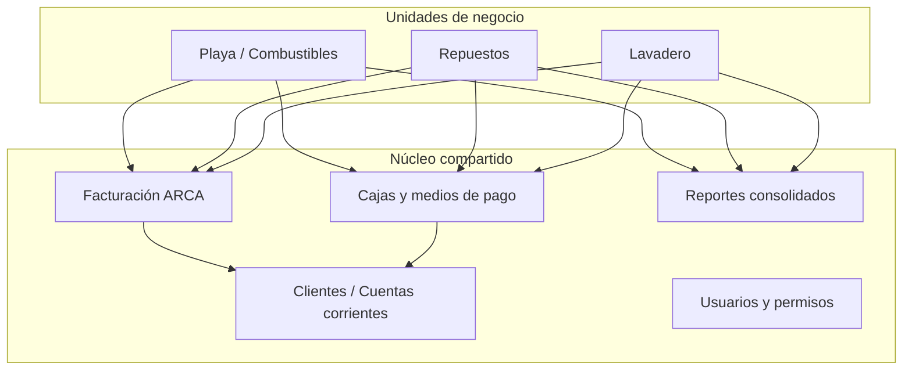
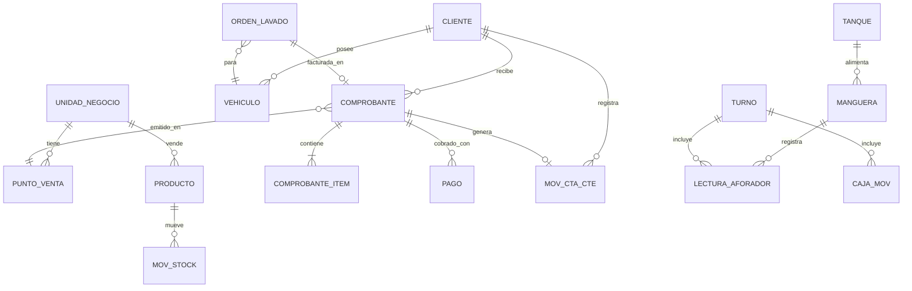
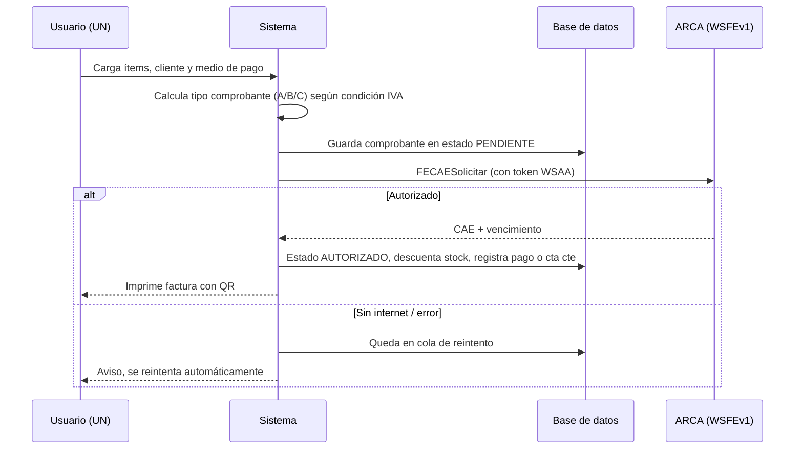

# ERP Estación de Servicio — Documento de diseño v0.1

Sistema de gestión unificado para tres unidades de negocio: **Playa (combustibles)**, **Repuestos** y **Lavadero**, con facturación electrónica ARCA, ventas, stock, caja y cuentas corrientes.

---

## 1. Idea central

Un solo sistema, una sola base de datos, pero con cada negocio separado por una **Unidad de Negocio (UN)**. Todo lo que se mueve (venta, cobro, stock, caja) lleva una marca de a qué UN pertenece. Así:

- Cada negocio ve y reporta **solo lo suyo** (ventas, stock, caja, rentabilidad).
- El dueño ve **todo consolidado**.
- Un cliente es **uno solo** para toda la estación (ej. un transportista o un productor agropecuario), con su cuenta corriente abierta por UN y un saldo total.



---

## 2. Tecnología propuesta

Elegida porque ya trabajás con **C# y Visual Studio**: te quedás en el mismo lenguaje en todo el sistema.

| Capa | Tecnología | Por qué |
|---|---|---|
| Lenguaje | C# / .NET 8 (LTS) | Lo conocés, es robusto, gratis |
| Backend | ASP.NET Core Web API | Centraliza reglas de negocio y ARCA |
| Base de datos | PostgreSQL (o SQL Server Express) | Gratis, confiable, soporta varios puestos |
| Acceso a datos | Entity Framework Core | Mapea clases C# a tablas, migraciones |
| Interfaz | Blazor Server (web, en C#) | Se usa desde cualquier PC/tablet de la LAN sin instalar nada |
| ARCA | Cliente SOAP generado desde WSDL (WSAA + WSFEv1) | Servicios oficiales |
| Impresión | Tickets/facturas en PDF + impresora térmica (ESC/POS) | Con QR obligatorio |
| Control de versiones | Git + GitHub | Trabajamos juntos sobre el código |

**Despliegue recomendado:** un servidor local (una PC dedicada o mini PC) en la estación, con el backend y la base. Las PCs de playa, repuestos y lavadero se conectan por red local. Si se corta internet **se sigue vendiendo**; solo la autorización ARCA queda en cola (ver sección 6). Backup automático diario a la nube.

Alternativa si preferís escritorio: mantener WinForms como cliente contra la misma API. Funciona, pero Blazor te evita instalar/actualizar en cada PC.

---

## 3. Módulos

### Núcleo (compartido)
- **Empresa / CUIT / puntos de venta**: puede haber un CUIT con un punto de venta por UN, o varios CUIT (a confirmar).
- **Usuarios, roles y permisos** por UN (playero, vendedor de repuestos, lavador, cajero, administrador, dueño).
- **Clientes**: datos fiscales (CUIT/DNI, condición IVA), límite de crédito, vehículos asociados (patente).
- **Facturación ARCA**: Factura A/B/C, notas de crédito y débito, CAE, QR.
- **Cajas**: apertura/cierre por turno, medios de pago (efectivo, débito, crédito, transferencia, QR, cuenta corriente).
- **Cuentas corrientes**: saldos, recibos, imputación de pagos, resumen mensual, bloqueo por límite.
- **Proveedores y compras**: facturas de compra, cuenta corriente con proveedores.
- **Reportes**: ventas por UN, margen, IVA ventas/compras (para el contador), deudores.

### Playa (combustibles)
- Productos: naftas, gasoil, GNC si aplica, lubricantes y shop.
- **Tanques** con stock en litros, **surtidores/mangueras**.
- **Turnos de playeros**: lectura de aforadores (totalizadores) al inicio y fin → litros vendidos por manguera.
- Conciliación: litros según aforadores vs. litros facturados vs. medición de tanque (varillaje).
- Descargas de camión cisterna (compras de combustible).
- Precios por litro con historial (cambian seguido).
- Venta rápida por importe ("$20.000 de súper") o por litros.
- Clientes con cuenta corriente y **remitos/vales** de carga que se facturan a fin de mes.

### Repuestos
- Artículos con código propio, código de fabricante, marca, rubro, equivalencias.
- Stock con mínimos, múltiples listas de precios, actualización masiva por % o por lista de proveedor (Excel/CSV).
- Presupuestos → venta → factura.
- Devoluciones con nota de crédito.

### Lavadero
- Catálogo de servicios (lavado simple, completo, motor, tapizado) con precio por tipo de vehículo.
- **Órdenes de trabajo**: patente, servicio, estado (en espera → lavando → listo → entregado).
- Turnos/agenda opcional.
- Insumos consumidos (shampoo, cera) descontados de stock.
- Comisiones o producción por lavador (opcional).

---

## 4. Modelo de datos (resumen)



Tablas clave:

- **UnidadNegocio**: Id, Nombre (Playa, Repuestos, Lavadero).
- **PuntoVenta**: Número ARCA, UN, tipo (electrónico web service).
- **Cliente**: CUIT/DNI, razón social, condición IVA, límite crédito, activo.
- **Producto**: código, descripción, UN, tipo (bien / servicio / combustible), alícuota IVA, impuestos internos (combustibles), precio, controla stock.
- **Comprobante**: tipo (FA, FB, FC, NC, ND, remito, presupuesto), punto de venta, número, fecha, cliente, UN, neto, IVA, otros tributos, total, **CAE, vencimiento CAE, estado ARCA** (pendiente / autorizado / rechazado).
- **ComprobanteItem**: producto, cantidad, precio, alícuota, subtotal.
- **Pago**: comprobante o recibo, medio de pago, importe, caja.
- **MovCtaCte**: cliente, UN, fecha, tipo (debe/haber), importe, comprobante origen.
- **MovStock**: producto, depósito/tanque, cantidad (+/-), origen (venta, compra, ajuste, consumo lavadero).
- **Turno / Caja / CajaMov**: apertura, cierre, usuario, diferencias.

Regla de oro: **nunca se borra un comprobante ni un movimiento**. Se anula con nota de crédito o contramovimiento. Esto da trazabilidad y cumple con lo fiscal.

---

## 5. Flujos principales

### Venta con factura (cualquier UN)



### Cierre de turno en playa
1. El playero abre turno: carga lectura inicial de aforadores de cada manguera y fondo de caja.
2. Durante el turno vende (facturas, remitos a cuenta corriente, tarjetas).
3. Al cerrar: carga lecturas finales → el sistema calcula litros por manguera × precio = importe esperado.
4. Compara contra lo cobrado por medio de pago → muestra diferencia (faltante/sobrante).
5. Litros sin facturar individualmente se pueden facturar a consumidor final en un comprobante resumen (a validar con el contador).

### Cuenta corriente
1. Cliente autorizado carga combustible, compra repuestos o lava → se genera remito o factura a cuenta corriente en su UN.
2. El sistema controla el límite de crédito (total de todas las UN).
3. A fin de mes: resumen por cliente, facturación de remitos pendientes.
4. Cuando paga: recibo, se imputa a comprobantes (FIFO o manual), se registra en caja.

### Orden de lavado
1. Llega auto → se crea orden con patente (si existe, trae cliente y vehículo).
2. Cambia de estado en una pantalla tipo tablero.
3. Al entregar → se factura o va a cuenta corriente.

---

## 6. Integración con ARCA

- **WSAA** (autenticación): con un certificado digital se firma un pedido y ARCA devuelve un token + sign válidos por ~12 h. Se cachean y reutilizan.
- **WSFEv1** (factura electrónica, RG 4291): comprobantes A, B y C. Métodos principales: `FECompUltimoAutorizado`, `FECAESolicitar`, `FECompConsultar`, y tablas de parámetros (tipos de comprobante, alícuotas, tributos).
- **Homologación (testing)**: certificado de prueba gestionado con el servicio WSASS. **Producción**: certificado desde "Administrador de Certificados Digitales" con clave fiscal del contribuyente.
- **QR obligatorio** en el comprobante impreso.
- **Contingencia**: cola de reintentos si no hay internet; evaluar CAEA (código anticipado) para cortes largos.
- **Combustibles**: llevan impuestos específicos (ICL / impuesto al dióxido de carbono) que se informan como tributos. Hay que definir con el contador cómo se discriminan en cada tipo de comprobante.
- Hay cambios normativos recientes (RG 5866/2026 modificó las RG 1415 y 4291): antes de salir a producción, validar con el contador de la estación.

---

## 7. Arquitectura del código

```
EstacionERP/
├── EstacionERP.Domain/          Entidades y reglas (Cliente, Comprobante, Turno...)
├── EstacionERP.Application/     Casos de uso (EmitirFactura, CerrarTurno, RegistrarCobro)
├── EstacionERP.Infrastructure/  EF Core, PostgreSQL, cliente ARCA, impresión
├── EstacionERP.Api/             ASP.NET Core Web API
├── EstacionERP.Web/             Blazor Server (pantallas)
└── EstacionERP.Tests/           Pruebas (cálculos de IVA, cierre de turno, cta cte)
```

La lógica de facturación ARCA vive **en un solo lugar** (Infrastructure) y todas las UN la usan. Así un cambio de ARCA se arregla una sola vez.

---

## 8. Plan por etapas

| Etapa | Contenido | Resultado |
|---|---|---|
| 0 | Relevamiento en la estación, definir CUIT/puntos de venta, hablar con el contador | Requisitos cerrados |
| 1 | Proyecto base, BD, usuarios, clientes, productos, UN | Esqueleto funcionando |
| 2 | Facturación ARCA en homologación (WSAA + WSFEv1) | Emitir factura de prueba con CAE |
| 3 | Módulo Repuestos (el más simple: stock + venta) | Primer negocio operativo |
| 4 | Cajas y cuentas corrientes | Cobros, recibos, saldos |
| 5 | Lavadero (órdenes + facturación) | Segundo negocio operativo |
| 6 | Playa (tanques, mangueras, turnos, aforadores) | Tercer negocio operativo |
| 7 | Reportes, backups, pase a producción ARCA | Sistema en uso real |

Arrancar por Repuestos es a propósito: valida facturación, stock y clientes sin la complejidad de la playa.

---

## 9. Preguntas para relevar en la estación

1. ¿Los tres negocios facturan con **el mismo CUIT** o con CUIT distintos? ¿Qué condición frente al IVA tiene (responsable inscripto, monotributo)?
2. ¿Qué usan hoy para facturar en la playa? ¿Tienen **controlador fiscal** o sistema del surtidor/bandera (YPF, Shell, Axion, etc.)? ¿La bandera exige algún sistema propio?
3. ¿Los surtidores tienen **controlador electrónico** que se pueda leer desde una PC, o las lecturas se cargan a mano?
4. ¿Cuántas PCs/puestos hay y dónde? ¿Qué tal es la conexión a internet?
5. ¿Cuántos clientes en cuenta corriente y cómo los manejan hoy (cuaderno, Excel)?
6. ¿Cuántos artículos de repuestos, y los proveedores mandan listas de precios en Excel?
7. ¿Qué reportes necesita el dueño y qué le pide el contador cada mes?
8. ¿Manejan tarjetas con posnet integrado, Mercado Pago, transferencias?
